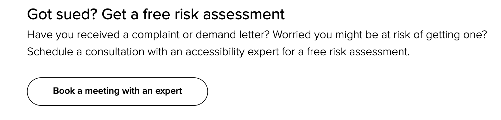

# Accessibility presentation for the Frontend Freunde

## Project description
Current project contains files and materials used in preparation for and giving the presentation to the [Frontend Freune Münster](https://www.meetup.com/de-DE/frontend-freunde/) which is held in [Zweitag](https://www.zweitag.de/en/ueber-uns) company office.

## Presentation structure
- Who am I and why do I speak about the accessibility topic?
- Objectives and things that I am aiming to achieve by the end of the presentaiton.
- Couple of numbers
- Motivation to invest your time into *accessibility*
- Lingo for the upcomming session, let's get comfortable with the subject. Inclusive and mindful way to speak about the accessibility. 
- Accessibility <> disability phenomena, is accessibility only for people with disabilities?
- Physical breaching into digital, first representations of the web "what is the web" WEB 1.0, 2.0 and further what is the future of the web? Who are the people on the web? (video)
- Legal situation in the **World**, **Europe** and specifically _*Germany*_.
-  Problem with WEB 2.0
    - Is it a button game (intro to semantic web problem)
    - Frameworks, libraries, design systems
- Challenges and ongoing research, the state of the **accessibility** topic today.
- Tools and standards to the rescure!
    - 
- What did we learn and achieve? 
    - We started with the general statistics on the the topic
    - Gotten into grips with lingo
    - "Profiteers" of the accessibility (study case)
