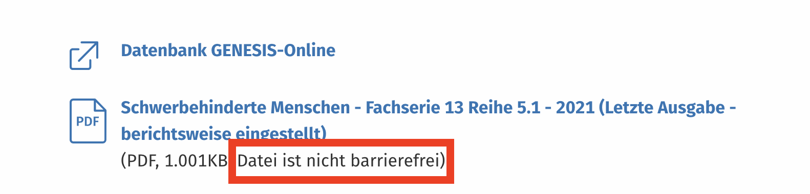
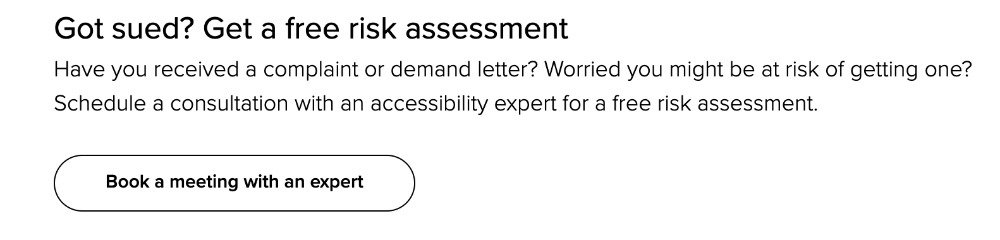

- Who am I and why do I speak about the accessibility topic?
  
  
  Lábas! (Lithianian greeting )
  → Frontend Developer
  → Technology enthusiast
  → Leeze enthusiast
	- Personal story LOHN
	  
	  👁️ https://www.perkins.org/what-blindness-really-looks-like/
- Objectives and things that I am aiming to achieve by the end of the presentaiton.
	- Raise the awareness about accessibility topic
	- Look at the current state of the WEB
	- Discuss ways we can contribute to better, more accessible WEB
- Couple of numbers
	- An estimated 1.3 billion people experience significant disability. This represents 16% of the world’s population, or 1 in 6 of us.
	- According to Eurostat estimates, that equals to **101 million** **people** or **one in four people adults in the EU**.
	- **7,9 Millionen** schwerbehinderte Menschen leben in **Deutschland 9.3%**
	  
- Motivation for the *accessibility*
	- 👩‍⚖️ Legal and ethical obligation
	  
	- 💶 Accessible web sites often cost less to maintain
	- 💯 Better experience for all audience groups
	- 👁️‍🗨️ Accessible web pages enhance your audience
- Lingo for the upcoming session, let's get comfortable with the subject. Inclusive and mindful way to speak about the accessibility.
	- **Person-first language:** Emphasize the person, not the disability. For example, "person with a disability" instead of "disabled person."
	- **Positive language:** Use words that convey empowerment and respect. Avoid terms like "confined to a wheelchair" or "suffering from a disability." 
	  **_Instead_**:
	  "uses a wheelchair"
	  "lives with a disability"
	  "person with a disability"
	  "person with a physical challenge"
	- **Disability:** A broad term that encompasses a wide range of impairments.
	- **Accessibility:** The design and implementation of products, services, and environments that are usable by everyone, regardless of their abilities.
	- **Assistive technology:** Devices, systems, or equipment that help people with disabilities to access information and perform tasks.
	- **Universal design:** A design approach that considers the needs of everyone, including people with disabilities.
	- **It's not a topic to learn** it is a life-long journey - **Be open to learn**
- Accessibility <> disability phenomena, is accessibility only for people with disabilities?
- How is it event possible (case study), car insurance for the blind people.
- WEB 1.0
	- Pre- and early internet era of the internet "what is the web?" {{video https://www.youtube.com/watch?v=95-yZ-31j9A}}
	-
	- {{video https://www.youtube.com/watch?v=BOHyLkp7TpE}}
	-
- WEB 2.0 - the era of interactive web pages and AJAX
- Who are the people on the web? (video)
- Legal situation in the **World**, **Europe** and specifically _*Germany*_.
- Problem with WEB 2.0
	- Is it a button game (intro to semantic web problem)
	- Frameworks, libraries, design systems
- Challenges and ongoing research, the state of the **accessibility** topic today.
- Tools and standards to the rescure!
	- Assessment of your web page ([WAVE plugin](https://wave.webaim.org/extension/))
	- Assessment of your web page ([axe DevTools plugin](https://chromewebstore.google.com/detail/axe-devtools-web-accessib/lhdoppojpmngadmnindnejefpokejbdd?pli=1))
	  [ESLint rules 1](https://web.dev/articles/accessibility-auditing-react)
	  [ESLint rules 2](https://typescript-eslint.io/rules/explicit-member-accessibility/)
	  [Web content accessibility guidelines (**WCAG**)](https://www.w3.org/WAI/standards-guidelines/wcag/)
	  [Google Lighthouse accessiblity scoring](https://developer.chrome.com/docs/lighthouse/accessibility/scoring)
- But what does it really *mean* to build accessible web pages (guidelines lense)? Brown field, green field and the future projects.
- Zweitag web page assessment, the good, the bad and everything in between (case study), trying out different plugins for the assessment.
- How to get involved?
- How to become accessibility advocate?
- What did we learn and achieve?
	- We started with the general statistics on the the topic
	- Gotten into grips with lingo
	- "Profiteers" of the accessibility (study case)
- AČIŪ ir IKI! (Tschuss!)